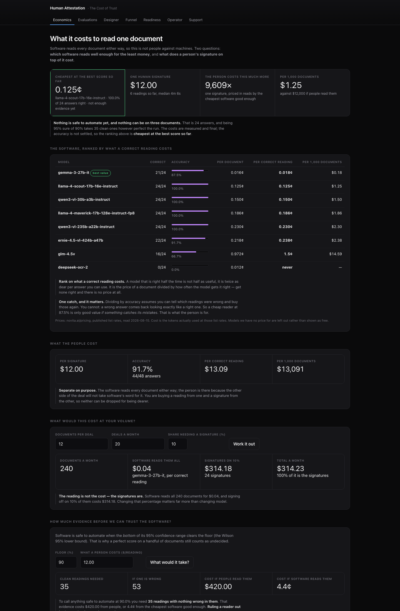
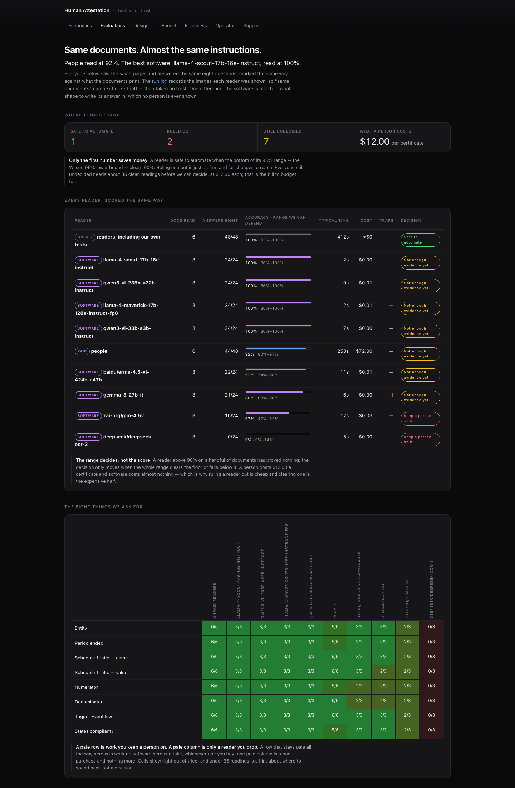
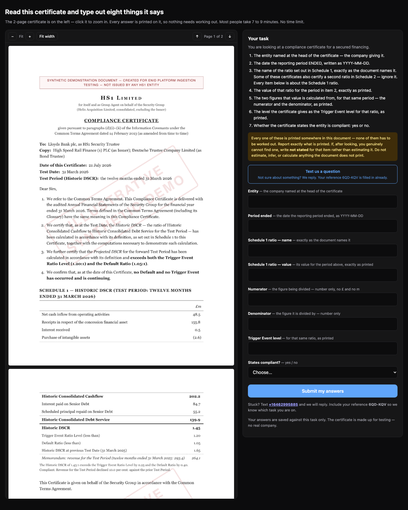
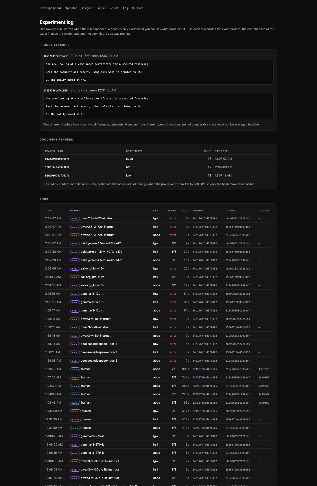
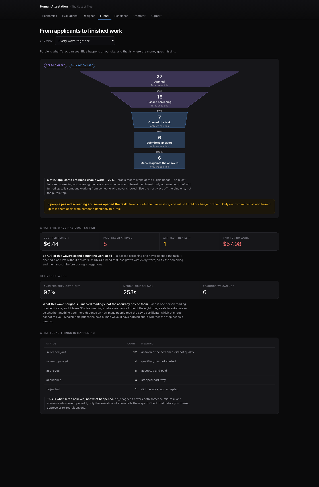
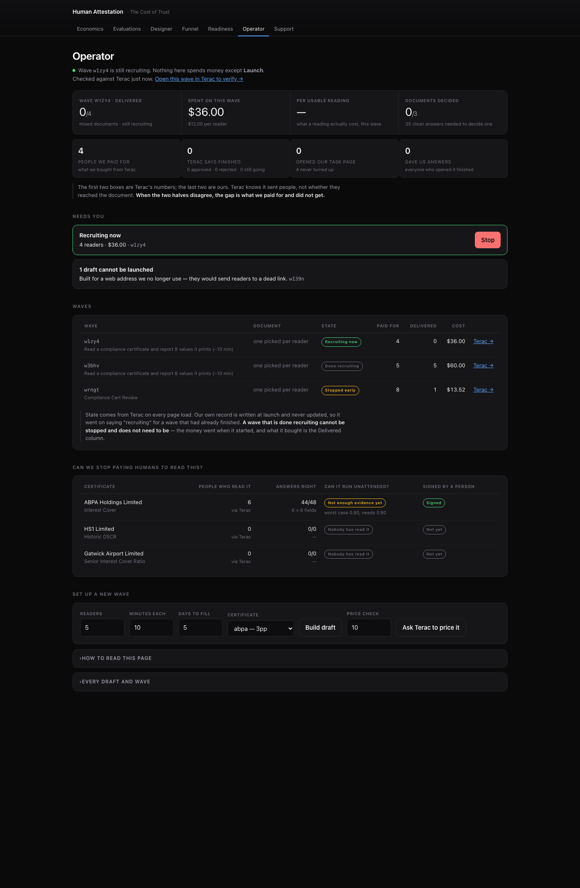

# Second Reading — the Cost of Trust

**Zero-Human Company Hackathon by Terac · 15 August 2026**
**Live:** https://hack-terac.onrender.com

A compliance certificate prints its current ratio next to last period's. Both
numbers are real, both are on the page, and a citation check passes on either
one. So when a reader reports the wrong one, no amount of automated
verification catches it — only a second, independent reading does.

This project measures what that second reading is worth. It puts paid human
experts and eight open-weight vision models on the **same certificate**, with
the **same eight questions**, scored by the **same function** against ground
truth the document itself prints, and reports what the evidence actually
licenses you to claim — not what the headline accuracy suggests.

---

## The result

| Reader | Readings | Fields right | Accuracy |
|---|---|---|---|
| Paid experts (via Terac) | 6 | 44/48 | 91.7% |
| Eight vision models | 24 | 155/192 | 80.7% |
| Walk-ups (unpaid, incl. our QA) | 6 | 48/48 | 100% |

**Nothing is licensed.** On six paid readings every one of the eight fields is
`NOT YET DISTINGUISHED` — the Wilson 95% lower bound sits under the 0.90 floor.
That is the honest finding, and the machinery is built to say it rather than
round 91.7% up into a claim.

Two models were ruled out outright (`glm-4.5v` at 67%, `deepseek-ocr-2` at 0%).
Ruling a reader **out** is cheap; clearing one **in** is the expensive half.

### The error that proves the point

`gemma-3-27b` reported **1.65** for HS1's Historic DSCR. That is the *previous*
test date's figure, printed inches from the current one. A citation checker
confirms it appears in the document, because it does.

A paid human made the mirror-image error on ABPA: **543.3** where the
certificate prints **534.3** — a digit transposition, not a trap.

Different failure modes, same consequence: neither is catchable by verifying
that an answer appears in the source.

---

## What it costs

A paid reading settled at **$12.00**. Licensing one certificate at the 0.90
floor needs about 35 clean readings — roughly **$420 per certificate**.

An early wave settled at $3.38/participant on a different configuration, and a
draft estimate once quoted $13.50 against a $1.69 settlement. **Draft pricing is
a machine estimate and is not evidence.** Only the post-launch settled charge
is, which is why the run log records what produced every number.

Total Terac spend across three waves: **$109.52**.

---

## The surfaces

| Path | What it shows |
|---|---|
| `/` | Coverage board — per-field readiness, Wilson lower bound vs the 0.90 floor |
| `/results` | Every reader scored the same way, plus the field-by-field heatmap |
| `/funnel` | Recruitment → delivery: what was paid for vs what came back |
| `/log` | One row per run with prompt hash, image content hash, and commit |
| `/ops` | Operator — draft a wave, read the settled price, launch |
| `/design` | Experiment designer |
| `/support` | Worker support over iMessage + QR |
| `/expert` | Open URL that mints its own id — hand it to anyone, no Terac needed |
| `/x/:wave` | The task page a recruited expert sees |

### Coverage board


### Results — every reader, scored identically


### The task an expert actually sees


### Run log — provenance for every number


### Recruitment funnel


### Operator


---

## How the measurement is kept honest

Most of the engineering went into *not* fooling ourselves. Each of these was a
real defect found and fixed during the build:

- **Same pixels, provably.** The run log records a content hash of the exact
  images each reader saw. An early comparison served humans ~110 DPI and models
  the full-resolution render — the filenames were identical, so only a content
  hash made it visible. Both arms now show the same hash per certificate.
- **One row per reader.** The provenance log keyed runs on
  `source:model:cert:prompt:images`, which is correct for a deterministic model
  and collapses for people — a 20-person wave would have written 3 rows and
  silently dropped 17 behind `ON CONFLICT DO NOTHING`. Readings are now keyed by
  subject.
- **Walk-ups are not the paid panel.** A null `model_id` meant unpaid readings
  landed in the paid-human bucket, which pushed the human lower bound over the
  floor and displayed a **false LICENSED** built on our own QA rows. Three
  populations are now separated, and walk-ups are labelled and excluded from
  licensing.
- **Correct answers stay correct.** The scorer marked `30-June-2026` wrong for
  using hyphens, and once marked "Senior ICR" wrong. A paid expert's reading
  scored as an error for a formatting choice is a manufactured result.
- **The instruction is not a hint.** A field hint read "the figure on top" —
  which on two of three certificates *is* the registered distractor. We were
  instructing readers into the wrong answer and recording it as a trap taken.
- **Price comes from the settlement, not the draft.**

## What this does not prove

- Six paid readings license nothing. No field clears the floor.
- Five of six paid readings are on one certificate (ABPA). A wave on HS1 — the
  certificate that discriminates — was recruiting when the event closed.
- Model runs and human runs share the same images but not the same prompt: the
  models are additionally given an output schema, which no person is shown. The
  run log's `prompt_sha` differs between arms and says so.
- The models were re-run after a resolution *and* instruction change at once, so
  "the models improved" is honest; "we can say why" is not.

---

## Stack

| Layer | Vendor | Outcome |
|---|---|---|
| Human input | **Terac** (MCP + REST) | Worked. 3 waves, 6 paid readings, screener rejected 22% of 36 applicants |
| Hosting | **Render** | Worked. Auto-deploy from `main`, free plan |
| Database | **Neon** Postgres | Worked |
| Payments | **Stripe** | Worked |
| Messaging | **Linq** | Worked — send + tapback approval |
| Agent coordination | **Band** | Worked — two Claude sessions coordinating, with real blocks and escalation |
| Open-weight models | **Novita** | Worked — 8 vision models |
| Open-weight models | **Pioneer** (Fastino) | **Did not work** — key valid, inference 403, plan never redeemed |

Two Claude Code sessions built this in parallel — one owning the expert-facing
surface, one owning deployment, data, and vendors — coordinating over Band.
Most of the defects listed above were caught by the *other* session reviewing,
not by the session that wrote the code.

---

## Run it

```sh
npm install
npm test          # 15 tests, no network, no database
npm start
```

Environment: `DATABASE_URL`, `APP_URL`, `TERAC_API_KEY`, `NOVITA_API_KEY`,
`STRIPE_SECRET_KEY`. Without them the app boots and the pages render from
whatever is in the database.

## Boundary

Standalone project. No Enid code, Enid data, client documents, or production
credentials. The three certificates are synthetic examples describing no real
company, person, or account. Real participants and real payments were in scope
for the event; synthetic fixtures stay visibly labelled.
